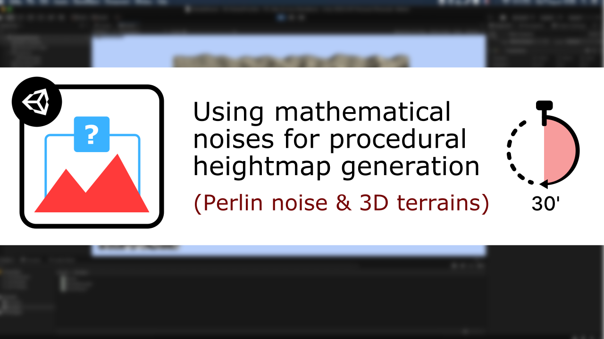

# [Unity/C#] Noises for Procedural Generation

**Mina Pêcheux - July 2021**

How can we use mathematical noises to generate heightmaps procedurally and apply them on Unity 3d terrains? Let's discover more in this video/text tutorial: "How to use mathematical noises for procedural heightmap generation in 30 minutes" :)

You can read it in text format [on Medium](https://medium.com/p/how-to-use-math-noises-for-procedural-generation-in-unity-c-44902a21d8e), or watch it [on Youtube](https://www.youtube.com/watch?v=tKfwC8swrtE).

In this 30 minutes-tutorial, I'm discussing the Perlin noise, Unity 2d textures, terrain objects and the Immediate Mode GUI (IMGUI) to create a basic small-sized noise-based heightmap exploration engine!

This Github repo contains additional resources to go further:

- various noise algorithms
- an improved manager to tweak even more parameters
- a basic GLSL shader to show the level curves on the terrain

